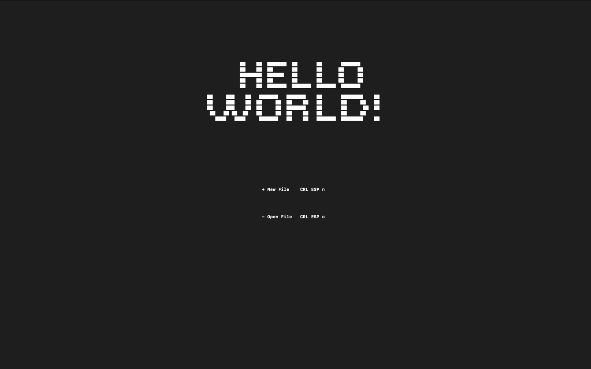
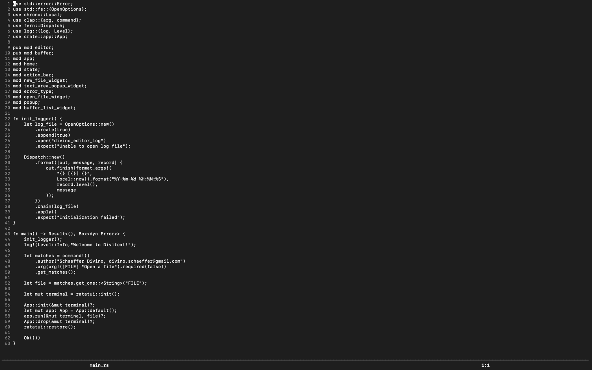
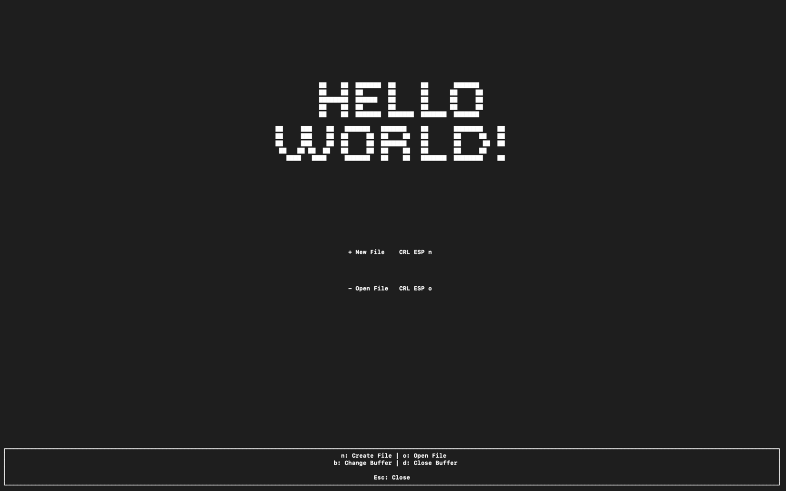
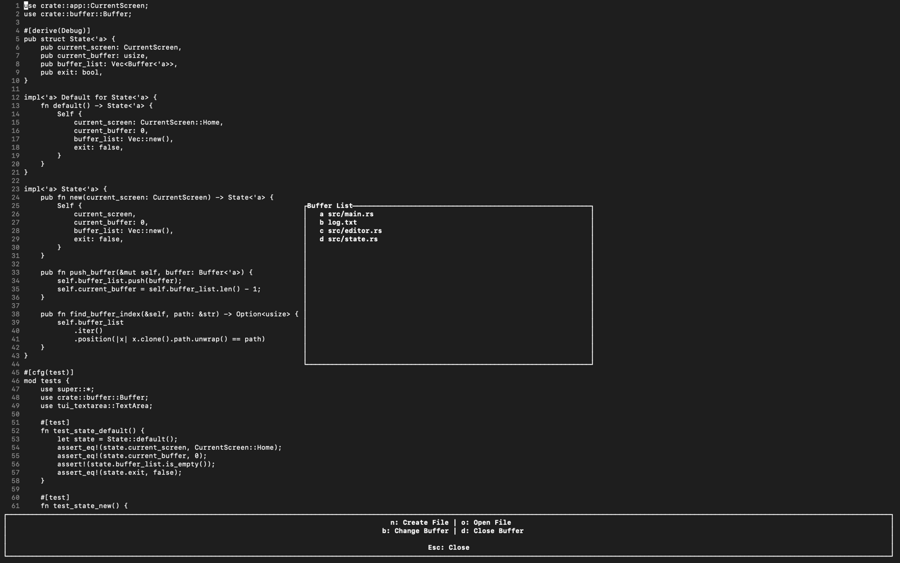

# Divitext

**Divitext** is a simple and lightweight terminal-based text editor, inspired by **Nano** and written in **Rust**.  
It offers essential features for creating and editing text files — all directly from your terminal.

Compatible with **Linux** and **macOS**.

---

## ✨ Features

- 📝 Create new files
- 📂 Open and edit existing files
- 💾 Save your changes
- ⌨️ Basic cursor movement and text manipulation
- ⚡ **Action Bar** for quick file operations (open, create, close)
- 🗂️ **Multiple Buffers Support** — edit several files at once!

---

## 🚀 Installation

Before getting started, make sure Rust is installed. If not, you can install it easily using [Rustup](https://rustup.rs/):

```
curl --proto '=https' --tlsv1.2 -sSf https://sh.rustup.rs | sh
```

Clone the repository and build the project:

```
git clone https://github.com/divinoschaeffer/divitext.git
cd divitext
cargo install --path .
```

Once installed, you're ready to edit!

---

## ⚡ Usage

To open a file:

```
divitext [filename]
```

Or launch without arguments to start with a blank buffer:

```
divitext
```

- If the file exists, it will be opened.
- If it doesn't, a new file will be created.




---

## 🧠 Features in Action

### Action Bar

Press `Ctrl + N` to toggle the **Action Bar**, which allows you to create, open, and close files without leaving the editor.



---

### Multiple Buffers

Work on several files at once by switching between buffers!  
Easily open, edit, and close files without restarting.



---

## 🤝 Contributing

Contributions are welcome! Whether it's a bug fix, feature suggestion, or pull request — all help is appreciated.

---

## 📜 License

This project is licensed under the MIT License.

---

If you want, I can also help you write a short description for crates.io or your GitHub repository tagline!