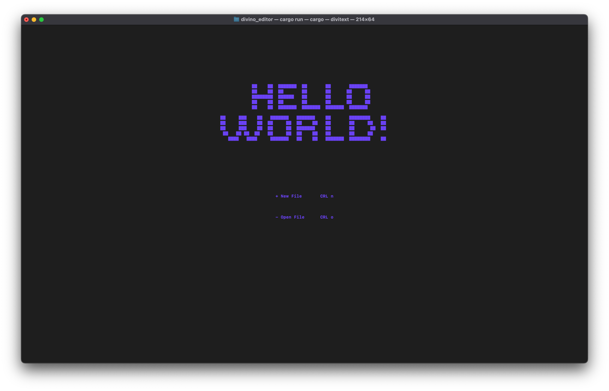

# Divitext

A simple terminal-based text editor similar to Nano, written in Rust. This editor provides basic functionalities such as creating a new file and editing an existing one. Compatible with Linux and macOS systems.

## Features

- Create new files
- Open and edit existing files
- Save changes
- Basic cursor movement and text manipulation

## Installation

To install and run the text editor, ensure you have Rust installed on your system. If not, install Rust using [Rustup](https://rustup.rs/):

```
curl --proto '=https' --tlsv1.2 -sSf https://sh.rustup.rs | sh
```

Then, clone the repository and build the project:

```
git clone https://github.com/divinoschaeffer/divitext.git
cd text-editor
cargo install path .
```

This will install the text editor.

## Usage

To start the editor, run:

```
divitex [filename]
```



- If `[filename]` is provided, the editor will open that file.
- If the file does not exist, it will be created.
- If no filename is provided, a new buffer will be opened.

## Contributing

Contributions are welcome! Feel free to open issues or submit pull requests.

## License

This project is licensed under the MIT License.

